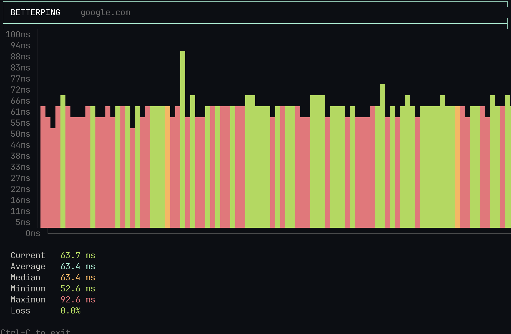

# betterping

A better way to look at `ping`.

`betterping` is a small terminal utility that continuously pings a host and turns the results into a live graph. Instead of scrolling through a wall of `time=23.4 ms`, you can actually see how your connection is behaving.

## Why?

The default `ping` output is very useful, but when you're trying to figure out whether your connection is stable, it's not particularly easy to read.

I wanted something that would let me glance at the terminal and immediately see:

- how the latency is moving
- whether there are sudden spikes
- the current average and median
- packet loss
- how the latest results compare to the rest

So I made `betterping`.

## Installation

git clone https://github.com/thearkabanerjee/betterping.git
chmod +x betterping
./betterping <url>